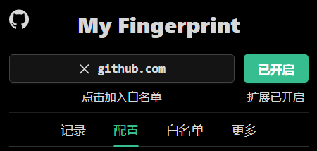

中文 | [English](./README_EN.md)

---

[--- v2.3 版本更新 ---](https://github.com/omegaee/my-fingerprint/releases/latest)

# My Fingerprint

- 可混淆各浏览器指纹标识
- 实用的`Chrome / Edge`扩展
- 安装即生效
- 可监控页面对指纹的访问情况
- 白名单模块

**支持指纹**
- [x] UserAgent系列
- [x] 屏幕系列
- [x] 语言
- [x] 时区
- [x] Canvas指纹
- [x] Audio指纹
- [x] Font指纹
- [x] WebGL指纹
- [x] WebRTC保护
- [x] WebGPU指纹

## 目录
- [使用](#使用)
- [功能模块](#功能模块)
- [测试目标](#测试目标)
- [社区](#社区)
- [支持一下](#支持一下)
- [声明](#声明)

## 使用

***插件安装：***
1. 下载扩展最新版本的`zip` -- [扩展下载](https://github.com/omegaee/my-fingerprint/releases/latest)
2. 打开浏览器扩展管理，开启开发者模式
3. 把下载好的`zip`拖拽进浏览器扩展管理页面
4. 启用扩展（若有需要，可在`详细信息`里勾选`InPrivate中允许`）

***插件使用：***
- 安装即生效（之前打开的标签页要刷新才生效）
- （可选）左键插件图标进入配置页面进行自定义配置

***前置：***
- 浏览器版本需求 - `Chrome 90+`

## 功能模块

### 配置模块
- 用于对各种指纹的自定义

**普通指纹配置**
- [x] UserAgent系列信息
- [x] 浏览器语言
- [x] 逻辑处理器数量
- [x] 屏幕尺寸
- [x] 屏幕颜色深度

**特殊指纹配置**
- [x] 时区
- [x] Canvas指纹
- [x] Audio指纹
- [x] Font指纹
- [x] WebGL指纹
- [x] WebRTC保护
- [x] WebGPU指纹

**其他配置**
- [x] 语言 - 扩展使用语言
- [x] 全局种子 - 作用于`根据全局种子随机值`选项
- [x] 网络请求钩子 - 根据配置内容修改网络请求头
- [x] Iframe钩子 - 对Iframe进行注入

### 记录模块
> 显示了当前标签页对各种指纹的访问次数

### 白名单模块
> 可对以白名单列表进行编辑

## 测试目标
- [x] https://webbrowsertools.com/
- [x] https://www.yalala.com/
- [x] https://uutool.cn/browser/
- [x] https://www.ip77.net/
- [x] https://www.browserscan.net/

## 社区
> 为了统一管理，建议优先使用 `Issues` 、 `Pull requests` 等功能

## 支持一下
- 本项目免费开源，如果你觉得对你有帮助，请给我一颗Star
- 如果有好的建议或意见，欢迎提交Issue或Pull Request
- 欢迎赞赏支持

| 微信 |
| :---: |
|  |

## 声明
- 若要进行某些较敏感的操作，请使用更加专业的工具。
- 本项目仅用于学习和研究，开发者不对因使用本项目而导致的任何损失或问题负责。