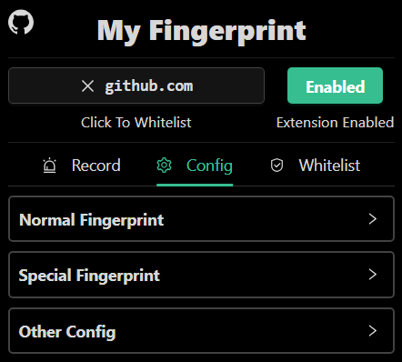

[中文](./README.md) | English

---

[--- v2.3 Update ---](https://github.com/omegaee/my-fingerprint/releases/latest)

# My Fingerprint

- Obfuscates Various Fingerprints of Browsers
- Useful `Chrome / Edge` Extension
- Installation takes effect immediately
- Monitor page access to fingerprints
- Whitelisting module

**Supports fingerprints**
- [x] UserAgent Series
- [x] Screen Series
- [x] Language
- [x] Time Zone
- [x] Canvas Fingerprint
- [x] Audio Fingerprint
- [x] Font Fingerprint
- [x] WebGL Fingerprint
- [x] WebRTC Protection
- [x] WebGPU Fingerprint

# Table of Contents
- [Usage](#usage)
- [Popup Module](#popup-module)
  - [Configuration Module](#configuration-module)
  - [Record Module](#record-module)
  - [Whitelist Module](#whitelist-module)
- [Test Target](#test-target)
- [Support](#support)
- [Disclaimer](#disclaimer)

# Usage

***Plugin Installation:***
1. Download the latest version of the Extension `zip` -- [Extension Download](https://github.com/omegaee/my-fingerprint/releases/latest)
2. Open the browser extension management, open the developer mode
3. Drag and drop the downloaded `zip` into the Browser Extension Manager page.
4. Enable the Extension (check `Allow in InPrivate` in `Details` if necessary).

***Plugin Usage:***
- Installation takes effect immediately (previously opened tabs have to be refreshed to take effect)
- (Optional) Left-click on the plug-in icon to enter the configuration page for customized configuration.

***Frontend:***
- Browsers that support the `Manifest V3` extension (most browsers do)

# Popup Module

## Configuration Module
- For customization of various fingerprints

**Normal Fingerprint Config**
- [x] UserAgent Series Info
- [x] Browser Language
- [x] Number of logical processors
- [x] Screen Size
- [x] Screen Color Depth

**Special Fingerprint Config**
- [x] Timezone
- [x] Canvas Fingerprint
- [x] Audio Fingerprint
- [x] Font Fingerprint
- [x] WebGL Fingerprint
- [x] WebRTC Protection
- [x] WebGPU Fingerprint

**Other Config**
- [x] Language - Languages used by browser extensions
- [x] Global Seed - Global Seed, Acts on `Random by Global Seed` Options
- [x] Web Request Hooks - Making changes to web request headers
- [x] Iframe Hooks - Injection into Iframe

## Record Module
> Shows how many times the current tab has been accessed for various fingerprints

## Whitelist Module
> The whitelist list can be edited

# Test Target
- [x] https://webbrowsertools.com/
- [x] https://www.yalala.com/
- [x] https://uutool.cn/browser/
- [x] https://www.ip77.net/
- [x] https://www.browserscan.net/

# Support
- This project is free and open source, if you think it is helpful to you, please give me a Star.
- If you have any good suggestions or comments, please feel free to submit an Issue or Pull Request.

# Disclaimer
- For certain more sensitive operations, use more specialized tools.
- This project is intended for educational and research purposes only. The developer is not responsible for any losses or issues caused by the use of this project.